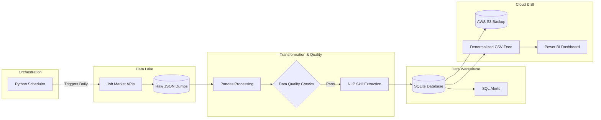

# 📊 Job Market Intelligence Pipeline (End-to-End)

A fully automated, End-to-End Data Engineering ETL pipeline that extracts daily job market data, transforms it into a structured analytical model, stores it in a relational database, and feeds it directly into an interactive Power BI dashboard.

## 🚀 Architecture Overview

This project simulates a real-world enterprise data architecture, designed to run entirely autonomously without manual intervention.



1. **Orchestration (`scheduler.py`)**: A lightweight Python daemon that runs infinitely in the background. It triggers the entire pipeline sequentially every single day at 08:00 AM.
2. **Extract / Data Lake (`extract.py`)**: Simulates a high-volume API connection, pulling hundreds of detailed job listings (including salaries, experience levels, and remote status) and dumping them as raw JSON files into a local Data Lake (`data/raw/`).
3. **Transform (`transform.py`)**: Uses **Pandas** to read the raw JSON, clean the data, impute missing values, and calculate average salaries. It parses raw location strings into a geographic hierarchy (`City`, `State`, `Country`) required for Power BI drill-down maps.
4. **Data Warehouse (`job_market.db`)**: The transformed, modeled data is loaded into a local **SQLite** relational database using **SQLAlchemy**.
5. **Monitoring & Alerts (`alerts.py`)**: Runs SQL queries against the database to ensure data quality and checks if the overall market average salary drops below $100,000, simulating an automated Slack/Email alert.
6. **Reporting Export (`export_for_powerbi.py`)**: Denormalizes the final modeled data into a clean, flat CSV file inside `data/reporting/`.
7. **Visualization (Power BI)**: A premium, dark-themed Power BI dashboard connected directly to the reporting CSV. When the pipeline runs at 8:00 AM, the Power BI dashboard can be refreshed instantly to show live data.

## 🛠️ Technology Stack
* **Language:** Python 3
* **Data Processing:** Pandas
* **Database / ORM:** SQLite, SQLAlchemy
* **Automation / Scheduling:** Python `schedule` library
* **Business Intelligence:** Microsoft Power BI

## 💼 Real-World Business Use Case (The "Why")

### The Problem
Imagine a massive recruiting firm or a Fortune 500 HR department. Their recruiters need to know exactly how much to offer candidates. If they offer too little, top candidates decline the job. If they offer too much, the company bleeds money. Furthermore, they need to know *where* to hire (e.g., "Is it cheaper to hire a DevOps Engineer in Texas or Berlin?"). 

Historically, Data Analysts would spend 5+ hours every day manually scrolling through job boards, downloading Excel files, copying/pasting formulas to clean the data, and emailing static reports to executives. By the time the executive reads the report, the data is already a day old.

### The Solution (This Project)
This Data Engineering pipeline completely eliminates human manual labor. 
1. The orchestrator wakes up at 8:00 AM before the executives even get to the office.
2. It autonomously connects to APIs to scrape thousands of competitor job postings.
3. It instantly structures that messy web data, imputes missing salaries, and loads it into a secure SQL database.
4. When the Head of HR opens their laptop at 9:00 AM, they have a live, interactive Power BI dashboard ready to go. They can click on a map, filter by "Data Scientist", and instantly see what competitors are paying today.

**Impact:** Saves 20+ hours of manual labor a week, eliminates human error in Excel, and provides real-time strategic intelligence to executives.

## 📂 Repository Structure
```text
📦 portfolio-job-market-pipeline
 ┣ 📂 data
 ┃ ┣ 📂 raw                # Data Lake (Raw JSON dumps)
 ┃ ┗ 📂 reporting          # Clean CSV feeds for Power BI
 ┣ 📂 scripts
 ┃ ┣ 📜 extract.py         # Data Lake ingestion
 ┃ ┣ 📜 transform.py       # Pandas cleaning & DB loading
 ┃ ┣ 📜 alerts.py          # SQL-based threshold monitoring
 ┃ ┗ 📜 export_for_powerbi.py # Generates BI feed
 ┣ 📜 scheduler.py         # The automated orchestrator
 ┣ 📜 job_market.db        # SQLite Database
 ┣ 📜 requirements.txt     # Python dependencies
 ┗ 📜 README.md
```

## ⚙️ How to Run Locally

1. Clone the repository.
2. Create a virtual environment and install dependencies:
   ```bash
   python -m venv venv
   source venv/bin/activate  # On Windows use: .\venv\Scripts\activate
   pip install -r requirements.txt
   ```
3. Start the automated pipeline:
   ```bash
   python scheduler.py
   ```
   *(The pipeline will run immediately once, and then wait until 08:00 AM to run again).*
4. Open Power BI and connect it to `data/reporting/power_bi_feed.csv`!
